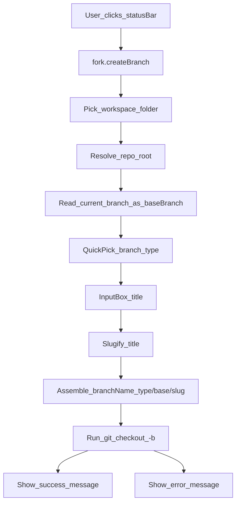

# Architecture & data flow

Fork is a small VS Code extension that wires UI prompts to a git command.

## Main components

- **Entry point**: `src/extension.ts`
  - Registers command `fork.createBranch`
  - Creates the status bar item (click → command)
  - Orchestrates the picker + input + git execution
- **Git adapter**: `src/git.ts`
  - Finds repo root
  - Reads current branch name (used as `baseBranch`)
  - Runs `git checkout -b <branchName>`
- **Naming utilities**: `src/slugify.ts`
  - `slugify(title, maxLen)` → `new-ui-for-user-profile-page`
  - `sanitizeBranchSegment(baseBranch)` prevents `/` from leaking into the “base branch” segment

## Data flow

## Error handling (high-level)

- **No workspace open** → prompts you to open a folder/workspace
- **Not a git repo** → errors (detected via `git rev-parse --is-inside-work-tree`)
- **Detached HEAD** → asks you to check out a base branch first
- **Git not found** → clear “install git” message

